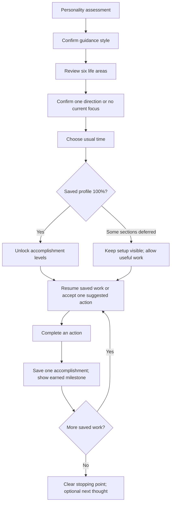

# From a ready profile to accomplishments

## Outcome and funnel audit

Setup should end with enough saved context to guide a useful first step. Reaching 100% unlocks a small accomplishment system; completing real actions advances it.

Build 09 had five gaps: the normal funnel never requested time or explicitly confirmed its default focus; levels appeared before setup was ready; every completion called itself the first; the final step bounced between Today and Profile; interrupted setup was too easy to lose.

Build 10 closes those gaps. The normal route is:

Skipped assessment users still choose their guidance style. Nothing current is a valid answer; no fabricated goal is required. A completed preference is reused, not requested again. Closing setup leaves a completion prompt on Today while existing work stays usable.

## Established pattern and Flow's adaptation

Todoist's official [Karma documentation](https://www.todoist.com/help/todoist/features/introduction-to-karma-OgWkWy) uses completed tasks and visible levels. Flow uses that established accomplishment pattern, with a smaller implementation: completed actions only. The numeric thresholds below are transparent Flow product choices for testing, not psychological assessment scores or a proven optimal reward schedule.

## Unlock and award contract

- Unlock once the persisted version-1 profile first reaches 100%. Persist the unlock, so later profile edits never take an earned level away.
- Existing real completed tasks count at unlock. Before unlock, no level number or earned count is shown.
- Count each distinct completed task ID once. Reload, re-acceptance, repeated taps, undo and deletion cannot farm credit or remove an accomplishment already earned.
- Exclude demonstration tasks. Recording, opening the app, granting permissions and buying anything do not earn progress.
- Store a separate version-1 accomplishment record, with unlock time and earned task IDs. Do not rewrite original notes or transcripts.
- Read saved records and reconcile serially in a transaction. Failed ledger writes do not display an unsaved award. A progress-sync error never blocks an otherwise successful answer or task save; show a retry route.

| Level    | Name              | Distinct actions completed |
| -------- | ----------------- | -------------------------- |
| 1        | Ready             | 0, after profile unlock    |
| 2        | First win         | 1                          |
| 3        | Building momentum | 3                          |
| 4        | Following through | 7                          |
| 5        | Steady progress   | 15                         |
| 6 onward | Level number      | Every 10 more actions      |

Profile displays one level, the accomplished-action count and the next milestone. Completion feedback is shared across Today task controls. No currency, competitive ranking, daily streak pressure or full-screen reward interruption.

## What remains after this release

The app currently knows selected interests and chosen steps; it does not yet prove that an entire larger goal is complete. The last-action screen says saved steps are finished, gives permission to pause, and offers optional capture. It must not manufacture follow-ups merely to keep a user active or increase their level.

The next product step is a goal-specific review: use confirmed outcome, constraints and original words to offer a narrow choice such as continue / waiting / finished for now. Only request missing details. An accomplishment count must remain separate from that goal-outcome status. That deeper review and the AI context snapshot remain on the product backlog.

## Acceptance checks

Full normal setup reaches 100%. Skips keep levels locked while actions remain usable. Empty interests need no invented action. Unlock and credit survive reload and later profile edits. Each task earns once. Demonstration actions earn nothing. Save failure can retry without false awards. The final onboarding button reaches Today even with deferred areas. The last completed action does not create a Today/Profile loop.

Build 10 validation: strict TypeScript, 113 automated tests and iOS/Android/web exports passed. Browser walkthrough covered all 20 assessment answers, interrupted setup and targeted resume, 100% unlock, first completion, persisted Level 2 after reload, the all-deferred exit, and a 390px layout. Physical iPhone verification remains a device test.
