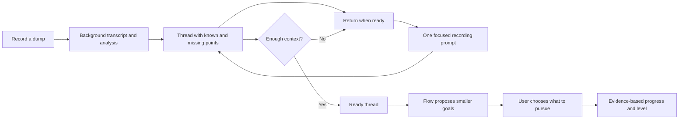

# Flow final product contract

Flow is a recording-first personal understanding system. A recording is allowed to remain a dump. Flow processes it in the background, connects it to the user's profile and prior threads, identifies missing context, and develops it only when the user returns.

## The single user promise

**Record it once. Flow keeps the thread, finds what is missing, and helps it become clear when you are ready.**

The user is never required to create a task, classify a routine, write a long form, or mark ordinary work complete just to preserve a thought.

## Profile fingerprint

Onboarding establishes the context Flow needs to interpret later recordings:

- life areas and current focus;
- obligations and active situations;
- people, hobbies, interests and longer-term goals;
- constraints, available capacity and important dates;
- preferred interaction mode;
- best-fit personality type and plain-language explanation.

The profile is collected through the existing assessment, narrow choices, and voice. It is a coverage map, not a demand to enumerate every task. A later recording can add a missing area. Profile completion shows what context is still unknown; it does not force the user to fill every field before recording.

## Thread lifecycle

Thread statuses are `dumped`, `understanding`, `ready`, `active`, `paused`, and `complete`. The user sees a plain-language label and the next useful option. The app resolves status from saved evidence and new recordings where possible; manual completion is a correction, not the main workflow.

Thread points are the fingerprint features Flow is collecting: outcome, people, timing, constraints, motivation, dependencies, and next context. Each point is known, missing, or suggested. Missing points are selected by the thread's information needs and the user's profile; Flow asks one narrow question at a time through recording or a short choice.

## Four interaction modes

The 16-type result is shown as a best-fit orientation. The four MBTI preference pairs produce 16 combinations; Flow groups those combinations into four interaction modes for presentation only:

- Explorer: record freely, connect later, delay interruption.
- Builder: show a short sequence after the thread is ready.
- Analyst: surface facts, dependencies and decisions.
- Connector: foreground people, communication and context.

The mode changes the wording, order and density of prompts. It never decides what matters, diagnoses the user, or blocks a recording. The user can correct the result, and real use can refine the presentation mode.

## Capture destinations

- **My mind:** threads that Flow may connect and develop.
- **Library:** recordings or notes the user explicitly wants to keep without creating a thread goal.
- **Feedback:** recordings or notes about Flow itself; never interpreted as a life task.

All three use the same record-first surface. Starting from a section supplies the destination. The user is not asked to sort the recording afterward.

## Goals and progress

Goals appear only after a thread has enough context. Flow proposes a small number of goals; the user chooses whether to pursue one. Repeated patterns are detected in the background and later offered as a possible routine or reusable skill. The user never maintains a repetitive-task inventory.

Progress belongs to the thread. A recording does not earn points. A goal is considered resolved from evidence in later recordings, linked calendar outcomes, or a user correction. Levels are small and encouraging: Starting point, Building, Momentum, Follow-through, and Mastery. Levels never pressure the user with streaks or punishments.

## Final scope for this release

Keep: profile assessment and coverage, one recording surface, local transcription, background organization, thread/map continuity, Library, Feedback, Apple Calendar handoff when a goal is ready, and local testing infrastructure.

Defer: broad integrations, automated outreach, recurring routines as a separate system, subscriptions, social features, and production/App Store release work.

## Release acceptance

1. A new user understands their profile path and can record without completing setup.
2. A recording produces a saved transcript and a thread or explicitly chosen Library/Feedback note.
3. The thread shows known points, missing points, source recordings, and one focused way to continue.
4. Returning or abandoning a thread preserves its place without generating duplicate tasks.
5. Goals appear only after the thread is ready; ordinary dumps do not become action lists.
6. Repeated patterns are suggested by Flow rather than entered manually.
7. Profile, thread progress and goal progress remain separate concepts.

Testing only. The release collaborator owns deployment and App Store integration.
