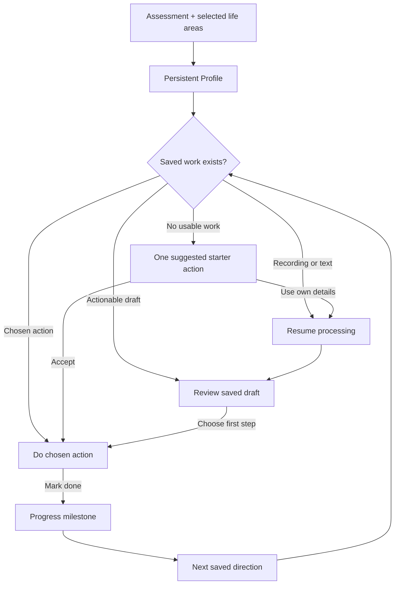

# Flow: one guided path from setup to action

**Current route contract:** [STRAIGHT-PATH.md](STRAIGHT-PATH.md) supersedes the build-08/10 routing below. Follow-through, contextual editing, a visible plan tree and purpose-specific capture are now core work, not future dashboard features.

## Product contract

Flow turns what a person supplies into a saved, reviewable next step. It remembers the connection between their interests, original words, draft and chosen action. It does not send people back to a blank page after assessing them.

The primary question for each screen is: **What can this person do with one decision now?** Free capture remains available, but is not a compulsory creative exercise.

## What the review found

Build 07 collected personality answers and life-area selections but only inserted the chosen direction into recorder prompt text. Notes, drafts and tasks had no direction link. Setup could be marked complete before recording. Today ignored the intake and showed the original blank-capture hero. Profile was a link back into the questionnaire. Server logs showed completed transcription/organization requests; they did not expose the user's phone-local answers or prove the funnel was useful.

## Established patterns we are adapting

- Finch starts users with concrete goals and keeps them on Home. Use the starter-action pattern, without the pet/reward economy: https://help.finchcare.com/hc/en-us/articles/42149821015693-New-User-Guide
- Fabulous journeys progress through one specific habit at a time. Use a continuing route instead of repeatedly asking for a goal: https://blog.thefabulous.co/boost-your-team-productivity-with-these-5-fabulous-habits/
- Tiimo converts intake into tasks/steps and supports a focused execution view. Connect intake to execution, rather than treating transcription as the end: https://www.tiimoapp.com/product/ai-planning and https://www.tiimoapp.com/product/focus

These are patterns verified in official public documentation, not a claim that we tested their paid onboarding or that personality-based recommendations are scientifically optimal.

## The app structure

**Today** is the main route. One main card resumes the most relevant saved step. Additional capture and existing calendar tools remain secondary.

**Profile** is a permanent destination: supplied information, personality summary, preferred guidance style, selected interests, linked action status and the next milestone. It does not rerun setup when opened.

**My mind / Library** retain drafts and originals. Drafts remain editable decisions; original recordings and transcripts retain their own words.

## Build 08 implementation

1. Carry a stable direction link on Note → ThoughtDraft → Task, including audio processing retries. Keep that metadata separate from the transcript and local to the device.
2. Derive the next step from saved records. Survey completion is not activation. Reopen real saved audio/drafts/actions before suggesting more intake; legacy records remain usable without invented links.
3. Suggest a small, reversible first action for each selectable interest, with its reason visible before accepting. Do not invent contacts, dates, medical instructions or legal obligations. An action is created only after an explicit tap.
4. Show one primary continuation on Today. Accepting a draft returns to Today with the chosen action, rather than asking the user to select another branch.
5. Give Profile factual coverage: valid answers out of 20; areas reviewed out of 6; areas deferred; selected interests and linked actions. 'Nothing current' is reviewed; 'Later' is deferred. Never report an invented understanding/accuracy percentage.
6. The original four setup milestones are superseded by [accomplishment levels](ACCOMPLISHMENT-LEVELS.md): unlock once Profile reaches 100%, then advance through distinct completed actions. Keep currencies, leaderboards and streak penalties out.
7. Preserve the full five-trait assessment and adjustable guidance preference. Personality affects presentation and suggestions, not whether an obligation matters.

## Follow-on work in priority order

- **Next:** confirm one real-world outcome, deadline and available time when necessary, using narrow choices plus targeted voice; reuse supplied details instead of asking twice.
- **Then:** maintain a context snapshot for AI (confirmed facts, preferences, active direction and unknowns). Ground every generated action in source or clearly label it as a suggestion. Keep personality secondary to explicit user instructions.
- **Then:** support gentle follow-through: completed / blocked / move later. Calendar changes require explicit intent and accurate dates.
- **Later:** recurring routines, cross-goal connections, invitations and feedback. Outreach automation, monetization and broad integrations wait until the setup-to-action loop is dependable.

## Acceptance bar

Profile setup completeness follows [PROFILE-COMPLETION-CONTRACT.md](PROFILE-COMPLETION-CONTRACT.md): five useful sections, a stable versioned percentage, and one direct route to the next missing piece. It is separate from action milestones and does not measure how accurately the app understands a person.

A returning user never loses the next step after a reload. Canceling recording does not earn progress. Reprocessing audio retains its direction and original words. A chosen task stays visible until completed. Completion advances factual progress once. Existing records survive the update. Profile and Today use the same derived state. All new behavior stays on testing; no production release.
