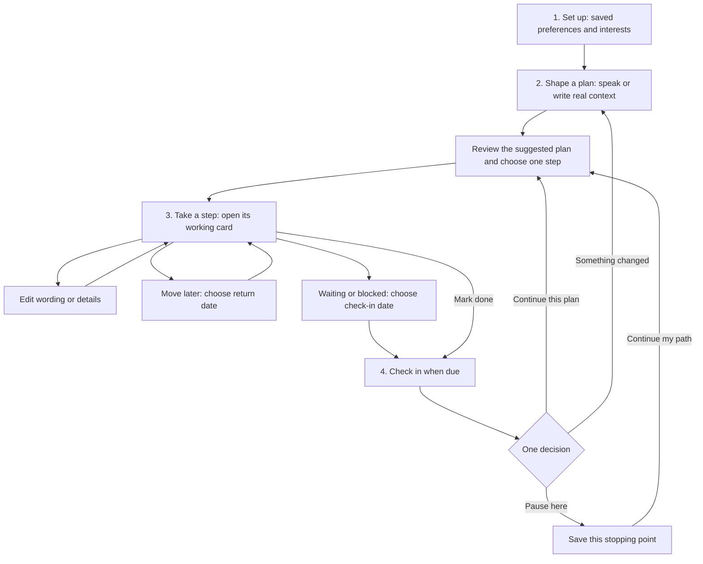

# Flow: one visible route, with a home for each input

The build-10 audit found a task picker where users expected a guided journey. A chosen action had only Done/Calendar controls; its plan was hidden elsewhere; postponing did not affect the primary recommendation; completing a step jumped to another interest. Profile completion and levels had become more visible than the work itself.

## The route users can follow

The same four-stage rail appears in setup, Today, plan review and the working step. Today shows the current plan, chosen step and one primary continuation. The visible map is interests → plans → actions, with links back to original words. The rail describes a planning cycle; it does not measure goal completion. Profile's existing 0–100% remains an explicit setup checklist.

## Clear homes, automatic routing

| Section | What goes here | What the app does |
| --- | --- | --- |
| My mind | Thoughts to shape into plans | Save the original, transcribe voice, suggest a draft, let the user choose a step |
| Library | Kept notes and original recordings | Save text/audio and transcribe without creating a task when entered as a kept note |
| Feedback | Comments about using Flow | Save written/spoken feedback separately; never turn it into a personal task |

Capture started within a section inherits its purpose. Existing uncategorized notes remain thoughts; original records survive. The feedback entry is visible in the header. Feedback is device-local in this testing build and is not sent automatically. All voice still uses the existing paired Mac mini processor; both devices must be reachable on the same network.

## State and continuity rules

- A saved active task remains the working step; new unrelated capture does not silently replace it. Explicitly changing focus clears this pointer.
- Future tasks remain in the map. Waiting and blocked tasks retain a review date and return as a check-in when due. This is in-app surfacing, not a new background notification service.
- Completing a real action saves a check-in. Opening the next draft or recorder does not resolve it. Cancel/reload returns to the same check-in. Choosing the next step resolves the previous check-in in that plan.
- Pausing saves the completed task as the stopping point. A due follow-up can still surface. A pause never means the wider goal is complete.
- Voice/text updates append to the existing plan. Original words, audio, step IDs and prior accomplishments remain intact. Processed update IDs prevent duplicates on retry.
- A failed saved update is resumed from the check-in; the user should not record it again.
- Task editing preserves identity, source links and contacts. Save failures retain edits. Calendar receives the current saved details and reports cancellation or success inside the same sheet. Editing a task alone does not silently change Apple Calendar.
- Saved time preferences influence suggestions after urgency. An explicitly chosen longer action remains visible, with its duration explained.

## Established patterns

This is Flow's implementation of familiar patterns, not a new psychological framework. [Getting Things Done](https://gettingthingsdone.com/what-is-gtd/) distinguishes capture, clarification, organization, review and action. [Nielsen Norman Group's wizard guidance](https://www.nngroup.com/articles/wizards/) supports a visible sequence with relevant questions and saved context, while warning against forcing frequent tasks through repetitive wizards. Flow uses guided setup once and a directly editable working card afterward. Prior Finch/Tiimo research remains in GUIDED-PRODUCT-PLAN.md.

## Acceptance walks

1. Fresh setup displays the route, preserves answers and hands off to shaping one plan.
2. Returning user identifies the current plan and working step without searching Profile.
3. Edit an action; its title/time change in Today, the map and accepted draft node.
4. Postpone/wait; it leaves ready-now recommendations and keeps its date in the map.
5. Complete; check in on the same plan. Cancel continuation, reload, then pause and reload.
6. A saved failed update can be resumed without duplicate intake. Retrying a processed update does not append again.
7. Save a Library note and Feedback; neither becomes a draft or task, and both remain in their own sections.

Testing only. Physical iPhone microphone, OS Calendar and notification behavior require device verification; browser checks and bundle exports do not establish those.

Build 11 validation: strict TypeScript and 156 automated tests pass, including task transitions/editor save failures, due follow-ups, same-plan update retries, capture-purpose separation and recording recovery. iOS, Android and web exports pass. Browser walkthrough verified first-run handoff, editable tasks, postponement, waiting, the live tree, check-in cancel/reload, saved pause/reload, and separate Library/Feedback intake. A 390×844 layout check verified the primary continuation is visible. The second QA origin exercised the safe basic-draft fallback; native microphone and Apple Calendar remain physical-device checks.
